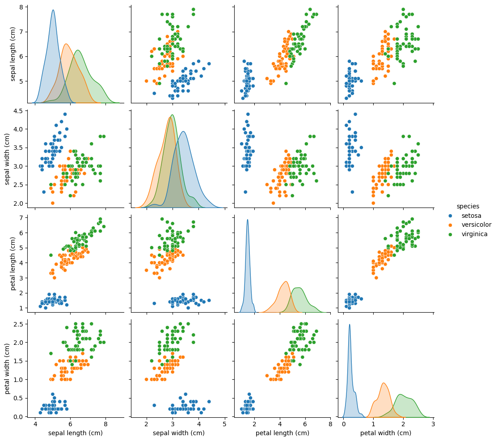

# 🌸 Iris Flower Classification (Machine Learning)

An end-to-end machine learning project that classifies Iris flowers into
**Setosa, Versicolor, and Virginica** using supervised learning models.

## 🚀 Features
- Exploratory Data Analysis (EDA)
- Data preprocessing & standardization
- Model training (KNN & Logistic Regression)
- Model comparison with accuracy metrics
- Confusion matrix & classification report
- Live prediction on new flower measurements

## 📊 Dataset
- UCI Iris Dataset
- 150 samples, 3 classes
- Features: Sepal & Petal length and width

## 🧠 Models Used
- K-Nearest Neighbors (K=3)
- Logistic Regression

## ✅ Results
- Achieved **~93% accuracy**
- Correct classification of all three species

## 📸 Screenshots
Include:
- Accuracy report
- Pairplot visualization
- Prediction output

## 🛠️ Tech Stack
- Python
- Pandas, NumPy
- Scikit-learn
- Matplotlib, Seaborn

## 📌 Author
Aniss Shaik

## 📸 Project Screenshots

### 🔹 Accuracy Report

### 🔹 Pairplot Visualization

### 🔹 Live Prediction Output

